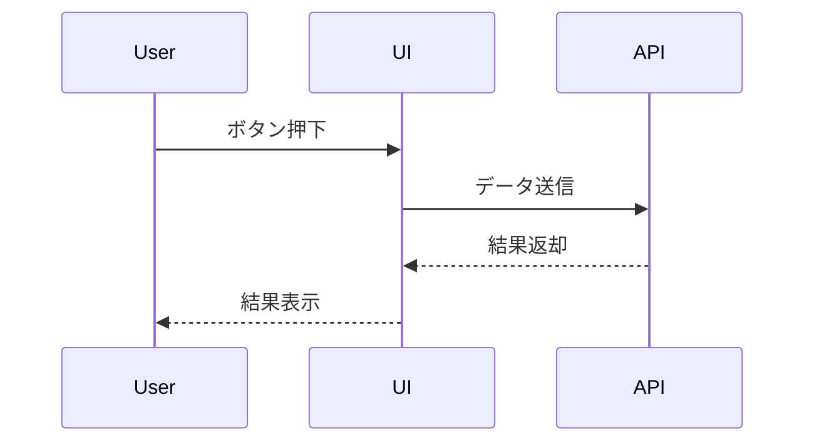
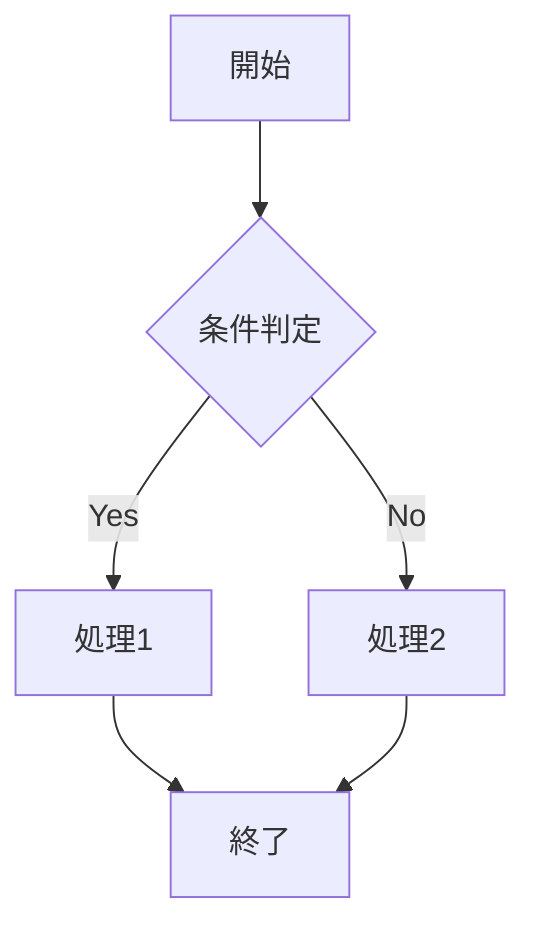

# Skill運用・設計ガイド（自リポジトリ用）

> **本ファイルはこのリポジトリ固有のSkill運用・設計ガイドです。**
> 一般ユーザ・他プロジェクト向けSkillテンプレートは skills/060_shared-templates/SKILL-template.md を参照してください。
> 用途・参照先の違いはREADME.mdにも明記しています。

## 1. Skillカテゴリ選択（必須）
以下から1つ選択：
- 要件・計画（requirements-and-planning）
- 設計・実装（design-and-implementation）
- 検証・品質（verification-and-quality）
- 運用・リリース（operations-and-release）
- 学習・改善（learning-and-improvement）

## 2. Skill命名規則（必須）
- フォルダ名・Skill名はkebab-case
- SKILL.mdを必ず配置

## 3. Skill設計ガイド（必須要素）
- フロントマター：name, description（発見しやすい語を含める）
- 実行フロー：Phase/段階ごとにAI/人間/承認ゲートを明示
- 参照優先順位：実装ファイル＞runbook.md＞SKILL.md＞実行ログ
- 証跡管理：append-only、承認・判定根拠・未解決事項を必ず記録
- 役割分担：方針決定・最終承認は人間、AIは調査・補助のみ
- 検証観点：正常系/境界値/異常系/回帰を基本セット
- 完了条件：全承認ゲート通過・必須出力物テンプレート準拠

## 4. Skillテンプレート参照
- .github/SKILL-template.md … このリポジトリ固有のSkillテンプレート（自リポジトリ用・独自運用ルール反映）
- 用途に応じて使い分けてください

## 5. 必須項目リスト（#sym:Skill生成時に必ず含める）
- カテゴリ（上記5つから選択）
- name（kebab-case）
- description（1文・トリガーワード含む）
- argument-hint（初期入力指示）
- 実行フロー（Phase/段階/ゲート/AI・人間分担）
- 参照優先順位
- 完了条件
- 主要成果物・テンプレート参照

## 6. サンプルSkill構造（抜粋）
```
skills/
    design-and-implementation/
        feature-implementation-unified/
            SKILL.md
            runbook.md
            assets/
            sub-skills/
```

## 7. Skill設計ベストプラクティス
- 曖昧な表現を避ける、例外処理やエッジケースも明記
- Mermaid記法でフロー・シーケンス図を活用
- 定期的な見直し・改善を推奨
- 主要ディレクトリごとに「用途」「主なファイル」「関連ドキュメント」を整理

---


## Mermaid記法サンプル




