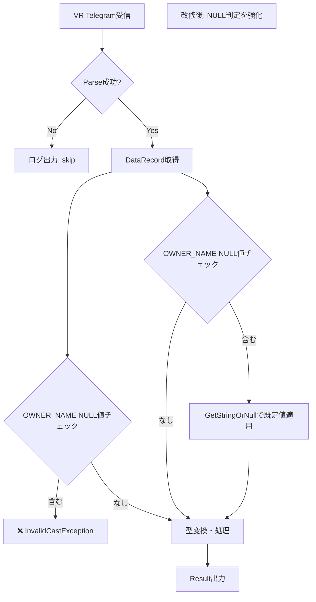

# 不具合対応 記入例（架空シナリオ）

省略用語（RACI, KPI, ADR, DDL, SLO, QA, PM, TRK, EX）は [../../shared-references/glossary.md](../../shared-references/glossary.md) の『略語・日本語対応表』を参照してください。

本ファイルは `runbook.md`（手順・判定基準の正本）と `assets/defect-log-template.md`（記録テンプレートの正本）を、架空の不具合対応シナリオで記入した場合のイメージです。**手順・判定基準そのものは runbook.md を参照してください。本ファイルは記入イメージの参考にとどめ、実行指示としては扱いません。**

## シナリオ概要

- **不具合ID**: #2024-001
- **タイトル**: `[ProcForEtgs] InvalidCastException when processing VR telegram`
- **対象プロジェクト**: ProcForEtgs.csproj
- **対象テーブル**: VEHICLE_REGISTRATION（列 `OWNER_NAME` は NULL 可）
- **症状**: `OWNER_NAME` が NULL のレコードを受信すると `InvalidCastException` が発生し、プロセスが異常終了する

---

## ログファイル基本情報

```markdown
# 不具合対応ログ - DB系（2026-03-27）

**ログファイル**: defect_repair_DB_20260327.md

## 基本情報

| 項目 | 内容 |
|------|------|
| **不具合ID** | #2024-001 |
| **タイトル** | [ProcForEtgs] InvalidCastException when processing VR telegram |
| **カテゴリ** | DB系 |
| **報告日** | 2026-03-20 |
| **対応開始** | 2026-03-27 09:00:00 +09:00 |
| **対応完了予定** | 2026-03-27 18:00:00 +09:00 |
| **ステータス** | 進行中 → 完了 |
| **開発者** | [名前] |
| **影響度** | クリティカル |
```

## 段階1-2: 準備・詳細化（まとめ記載）

```markdown
## 段階1-2: 準備・不具合詳細化（2026-03-27 09:30:00 +09:00）

### 確認事項
- ✓ 対象プロジェクト: ProcForEtgs.csproj
- ✓ 対象テーブル: VEHICLE_REGISTRATION
- ✓ エラー: InvalidCastException @ LibEtgsCommon.cs:142
- ✓ 再現性: 100% (OWNER_NAME=NULL 時)

### 準備完了
- ✓ csproj 確認済み
- ✓ DDL 確認済み
- ✓ テスト環境あり

**ステータス**: 段階3 の開発者入力待機
```

## 段階3: 開発者が不具合内容を入力

```markdown
## 段階3: 開発者が不具合内容を入力（2026-03-27 10:00:00 +09:00）

### 不具合内容

| 項目 | 内容 |
|------|------|
| **症状** | InvalidCastException in DataRecord.GetXxx() |
| **発生タイミング** | VEHICLE_REGISTRATION telegram 受信時、OWNER_NAME=NULL |
| **ログ** | System.InvalidCastException: Unable to cast object of type 'System.DBNull' to type 'System.String'. |
| **再現** | 100% 再現可能 |
| **影響** | ProcForEtgs プロセス異常終了 |
| **環境** | 本番環境 |

**承認ステータス**: 未承認（段階4 調査開始前）
```

## 段階4: AI が原因調査を実施

```markdown
## 段階4: AI が原因調査を実施（2026-03-27 10:30:00 +09:00）

### 調査結果

**原因候補1**: DBNull 起因のキャスト例外（確度: 高）

**根拠**:
- Stack trace で `(string)dataRecord["OWNER_NAME"]` が指摘
- DDL確認: OWNER_NAME は NULL可カラム
- 実装: 直接キャストで NULL チェックなし

**検証方法**: テスト環境で OWNER_NAME=NULL のレコードを作成し、同一Exceptionで再現 ✓

### ログ記録項目

| 項目 | 値 |
|------|-----|
| **TRK** | TRK-001 |
| **根拠ファイル** | LibEtgsCommon.cs:142 |
| **根拠SQL** | DDL: VEHICLE_REGISTRATION.OWNER_NAME VARCHAR(100) NULL |
| **採用判定** | 確定 |
| **対応推奨** | DataRecordExtensions 置換 |
```

## 段階5: AI が処理フロー図を生成

対応前/対応後フローの Mermaid サンプル（フロー設計基準は runbook.md 段階5 参照）:



## 段階6: AI が対応案を生成

```markdown
## 段階6: AI が対応案を生成（2026-03-27 11:30:00 +09:00）

### 対応案サマリ

| 案 | 名称 | 工数 | リスク | 推奨度 |
|----|------|------|--------|--------|
| 1 | DataRecordExtensions 置換 | 2h | 低 | ⭐️ 推奨 |
| 2 | 層厚い NULL判定 | 4h | 中 | △ |
| 3 | DB 設計見直し | 8h | 高 | ✗ |

### 対応案1の詳細

**方法**: DataRecordExtensions メソッド使用

**変更対象**: LibEtgsCommon.cs / ProcessVehicleData()

**実装概要**:
- Before: `string ownerName = (string)dataRecord["OWNER_NAME"];`
- After: `string ownerName = dataRecord.GetStringOrNull("OWNER_NAME") ?? "不明";`

**メリット**: 最小規模の変更／リスク低い／既存パターンと一致
**デメリット**: NULL時の既定値が妥当か確認必要
**テスト対象**: NULL条件のユニットテスト 5件追加
```

## 段階7: 開発者が対応案をレビュー・決定（ゲート条件 #1）

```markdown
## 段階7: 開発者が対応案をレビュー・決定（2026-03-27 12:00:00 +09:00）

**ゲート条件のチェック**:
- [x] Phase 1 成果が十分な品質か → OK
- [x] 複数案が検討されているか → OK（3案）
- [x] 決定可能な情報量があるか → OK

### 決定
**選定案**: 対応案1（DataRecordExtensions 置換）

**決定根拠**:
1. 【技術】最小変更で問題解決 + 既存パターン適用可
2. 【運用】本番導入リスク最小
3. 【保守】NULL判定の標準化

**承認ステータス**: ✓ 承認済 — 段階8 へ進行可能
```

## 段階8-9: 実装決定・実施・レビュー

```markdown
## 段階8-9: 実装決定・実施・レビュー（2026-03-27 13:00:00 +09:00）

### 変更概要

| ファイル | 変更内容 | 行数 |
|---------|---------|------|
| LibEtgsCommon.cs | GetStringOrNull() 置換 | +5 |
| ProcForEtgsTest.cs | NULL テスト追加 | +60 |

### Before/After
\`\`\`csharp
// Before
string ownerName = (string)dataRecord["OWNER_NAME"];

// After
string ownerName = dataRecord.GetStringOrNull("OWNER_NAME") ?? "不明";
\`\`\`

### Code Review
- [x] 対応案と一致している → OK
- [x] NULL判定が正確 → OK
- [x] ビルド成功 → OK（Warning: 0）

**承認ステータス**: ✓ 承認済 — Phase 3 へ進行可能
```

## 段階10-11: チェック項目生成・承認（ゲート条件 #2）

```markdown
## 段階10-11: チェック項目生成・承認（2026-03-27 14:00:00 +09:00）

### チェック項目（総数9件: 自動7 + ダミー実装1 + 手動1）

| TRK | 分類 | テスト項目 | 実施方法 |
|-----|------|----------|--------|
| TRK-001 | 正常系 | 全フィールド有効値 | 自動 |
| TRK-002 | 境界値 | OWNER_NAME=NULL | 自動 |
| TRK-003 | 境界値 | REG_NUMBER=NULL | 自動 |
| TRK-004 | 境界値 | RESIDENCE_CODE=NULL | 自動 |
| TRK-005 | 境界値 | 複合NULL | 自動 |
| TRK-006 | 異常系 | 型不一致 | 自動 |
| TRK-007 | 異常系 | DB接続エラー | ダミー実装 |
| TRK-008 | 統合 | 連続処理 | 手動 |
| TRK-009 | 回帰 | 既存テスト全実行 | 自動 |

### ゲート条件チェック
- [x] チェック項目が改修点を網羅 → OK
- [x] テスト方法が実現可能 → OK
- [x] ダミー実装対象が明示 → OK（TRK-007）

**承認ステータス**: ✓ 承認済 — 段階12 へ進行可能
```

### TRK-007 のダミー実装内容（DB接続エラー時の動作）

外部依存（DB接続）を計測困難な場合の代替実装例:

```csharp
[Test]
public void Test_HandleDbConnectionError()
{
    // Arrange
    var mockDb = new Mock<IDbConnection>();
    mockDb.Setup(d => d.Open()).Throws(new SqlException(...));

    // Act
    var result = _processor.Process(mockDb.Object);

    // Assert
    Assert.That(result.Status, Is.EqualTo(ProcessStatus.Failed));
    Assert.That(result.ErrorMessage, Contains.Substring("DB接続失敗"));
}
```

## 段階12: AI が動作確認を実施

```markdown
## 段階12: AI が動作確認を実施（2026-03-27 15:00:00 +09:00）

**合格率**: 100% (9/9)

| TRK | テスト項目 | 結果 |
|-----|----------|------|
| TRK-001〜TRK-006 | 正常系/境界値/異常系 | ✓ PASSED |
| TRK-007 | DB エラー | ✓ PASSED（Mock で再現） |
| TRK-008 | 連続処理 | ✓ PASSED |
| TRK-009 | 回帰テスト | ✓ PASSED（既存42件全合格） |

### ビルド・静的チェック
**ビルド**: ✓ 成功（Warning: 0） / **StyleCop**: ✓ PASSED / **Analyzers**: ✓ PASSED
```

## 段階13: 開発者がテスト結果をレビュー・承認（ゲート条件 #3）

```markdown
## 段階13: 開発者がテスト結果をレビュー・承認（2026-03-27 16:00:00 +09:00）

**合格率**: 100% (9/9) → OK
**ビルド**: ✓ 成功、警告 0 → OK
**不合格項目**: なし → OK

**最終品質判定**: ✓ OK — リリース可能
**承認ステータス**: ✓ 承認済 — Phase 4（報告）へ進行可能
```

## 段階14: 最終報告

```markdown
## 段階14: 最終報告（2026-03-27 17:00:00 +09:00）

### 対応サマリ

| 項目 | 内容 |
|------|------|
| **対応期間** | 2026-03-27 (1日) |
| **テスト合格率** | 100% (9/9) |
| **変更ファイル** | 2（LibEtgsCommon.cs, ProcForEtgsTest.cs） |
| **ビルド** | ✓ OK |
| **リリース可能性** | ✓ 準備完了 |

### Lessons Learned
1. **成功ポイント**: 体系的な調査 + 複数案検討により、最適な対応を選定できた
2. **改善提案**: DataRecordExtensions 習慣化で再発防止
3. **再発防止策**: 横展開で他 Proc も確認推奨

**最終ステータス**: ✓ 完了 — 本番導入準備完了
```

---

## 誤記訂正の記入例

```markdown
## 訂正: 段階4 の根拠ファイル（2026-03-27 11:15:00）

**誤記**: 記載：根拠ファイル = TableDefinition.sql
**訂正**: 正確：根拠ファイル = deploy/DB/SQL/rmsdb_ddl.sql
**理由**: 正確なファイルパスを確認
```

---

**バージョン**: 1.0
**作成日**: 2026-08-22
**参照元**: runbook.md（手順の正本）, assets/defect-log-template.md（記録テンプレートの正本）
