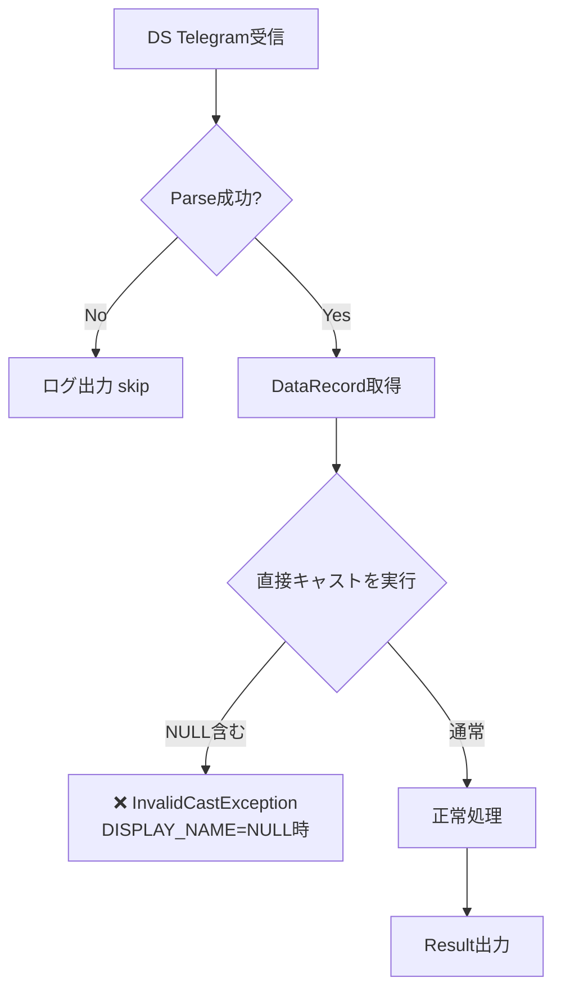
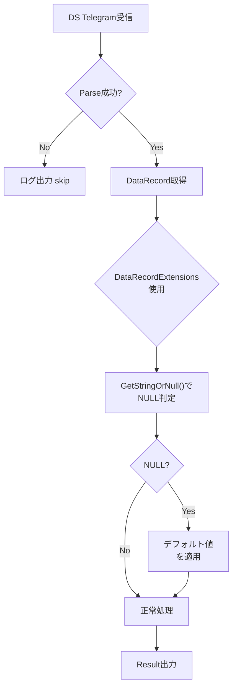

# Phase 1 Sub-Skill: 調査・分析・対応案決定（段階1-6）

省略用語（RACI, KPI, ADR, DDL, SLO, QA, PM, TRK, EX）は [../../../shared-references/glossary.md](../../../shared-references/glossary.md) の『略語・日本語対応表』を参照してください。


## 概要
Phase 1 では、不具合の原因を調査し、複数の対応案を検討决定する最初の段階です。開発者との協力により、調査結果から対応案まで、論理的に進める必要があります。

## 責務
- **AI**: 調査実施、フロー生成、対応案提示
- **開発者**: 不具合入力、調査結果のレビュー、対応案の決定

## 段階ごとの入出力

### 段階1: 準備（初期情報収集）
**AI の作業**:
1. 対象プロジェクト（Proc**/Skd**/Lib*/Sim*等）を特定
2. csproj ファイルから TargetFramework、依存プロジェクトを確認
3. 対象テーブルの DDL（column、NULL可否）を確認
4. 既存テスト（xxxTest.csproj）の有無を確認
5. 関連ログの保管場所を確認

**出力サンプル**:
```
## 段階1: 準備（初期情報収集）（2026-03-27 14:00:00）

### 対象プロジェクト
- ProcDataSync（メイン処理）
- ProcDataSyncTest（テスト）
- LibDataCommon（共通ライブラリ）

### 環境情報
- TargetFramework: net8.0-windows
- 依存: Npgsql, Newtonsoft.Json, LibComMng

### DB スキーマ
- テーブル: DATA_RECORD
- 対象列: RECORD_ID (NOT NULL), DISPLAY_NAME (NULL可), ...

### テスト有無
- ✓ ProcDataSyncTest.csproj 存在
- テストクラス: DataRecordProcessorTest

### ログ保管
- Path: logs/ProcDataSync/
- 形式: NLog (*.log)

**次: 不具合入力待機**
```

**開発者への確認**:
- [ ] プロジェクト特定が正確か
- [ ] 関連ファイル（csproj, DDL, テスト）へのアクセスは可能か

---

### 段階2: 不具合内容の詳細化
**AI の作業**:
1. 開発者から不具合情報を受け取る
2. 症状（error message, stack trace）を解析
3. 発生条件（特定データ, タイミング, 環境）を整理
4. 影響範囲（1プロセス/複数）を算定

**情報確認チェックリスト**:
- [ ] エラーメッセージ/コードが具体的か（推測ではなくログ根拠）
- [ ] Stack trace から発生ファイル・行番号が特定できるか
- [ ] 再現シーケンスが示されているか（或いは発生傾向が描述されているか）
- [ ] 本番環境か/テスト環境か/開発環境か が明記されているか

**出力サンプル**:
```
## 段階2: 不具合内容の詳細化（2026-03-27 14:15:00）

### 症状
- Error: InvalidCastException
- Location: LibDataCommon.cs, line 142, method ProcessDataRecord()
- Message: "Unable to cast object of type 'System.DBNull' to type 'System.String'."

### 発生条件
- DS (DATA_SYNC) telegram 受信時
- DISPLAY_NAME フィールドが NULL の場合
- 100% 再現可能

### 影響範囲
- 主: ProcDataSync プロセス
- 副: SkdDataRoute（DS情報に依存） への影響あり

### 環境
- 本番環境で発生
- PostgreSQL 15.x
- .NET 8.0-windows

**次: 開発者に段階3で入力依頼**
```

---

### 段階3: 開発者が不具合内容を入力
**開発者の作業**:
開発者が正式に不具合を入力します。

**入力フォーマット**:
```markdown
## 段階3: 開発者が不具合内容を入力（日時）

### 不具合タイトル
[Module] 簡潔なエラー説明

### 症状
- [エラーコード/メッセージ]
- [Stack trace, 発生ファイル/行]
- [ログ出力内容]

### 発生条件
- [データ条件]
- [タイミング条件]
- [再現性 (100%再現/稀発)]

### 影響範囲
- [直接影響プロセス]
- [間接影響モジュール]

### 環境
- [OS, .NET version, DB version]
- [本番/テスト/開発]

**確認**: 承認ステータス: 未承認（段階4開始前）
```

**AI の確認**:
- [ ] 必要な情報がすべて入力されているか
- [ ] 次段階（原因調査）に進む準備は整っているか

---

### 段階4: AI が原因調査を実施
**AI の作業フロー** （優先順）:

#### 1. ログ解析
- Stack trace から `ProcessDataRecord()` method を特定
- DB アクセス（SELECT）の行番号特定
- DBNull → キャスト が原因である可能性を確認

#### 2. 実装ファイル確認
```csharp
// Before（問題あり）
string displayName = (string)dataRecord["DISPLAY_NAME"];  // DBNullでException
```

#### 3. DDL 確認
```sql
-- Schema確認
COLUMN DISPLAY_NAME VARCHAR(100) NULL
```

#### 4. 仮説立案
- **仮説1（確度高）**: DBNull 起因のキャスト例外
  - 根拠: DISPLAY_NAME は NULL可、直接キャストを実施、stack traceで当該行が示される
  - 検証方法: DBラムダで DISPLAY_NAME=NULL の DS telegram を送信、同じException が発生するか確認

- **仮説2（確度中）**: NULL チェックの漏れ
  - 根拠: DataRecordExtensions を使用していない可能性
  - 検証方法: メソッド全体をコード検査、全 NULL判定を確認

- **仮説3（確度低）**: Npgsql version の不一致
  - 根拠: NULL マッピング挙動が version で異なる可能性（低確度）

**出力サンプル**:
```
## 段階4: AI が原因調査を実施（2026-03-27 14:30:00）

### 調査方法
- [X] Stack trace 解析
- [X] 実装ファイル確認
- [X] DDL 確認
- [ ] 動的テスト（別途実施）

### 原因候補一覧（優先度順）

#### 候補1: DBNull 起因のキャスト例外（確度: 高）
**根拠**:
- Stack trace: LibDataCommon.cs:142 の `(string)dataRecord["DISPLAY_NAME"]` が指摘
- DDL: DISPLAY_NAME は NULL可カラム
- 実装: 直接キャストで NULL チェックなし

**検証方法**:
1. ダムデータ DB に DISPLAY_NAME=NULL のレコード挿入
2. DS telegram 送信
3. 同じException が再現できるか確認

**対応可能性**: ✓ 高（DataRecordExtensions 置換で対応可）

#### 候補2: NULL チェックの漏れ（確度: 中）
**根拠**:
- メソッド内で複数の DB アクセスがあり、全てに NULL チェックがあるか不明

**検証方法**:
- 全コードをスキャン、NULL 判定の実装パターンを確認

**対応可能性**: ✓ 中

#### 候補3: Lib バージョン不整合（確度: 低）
**根拠**: 他プロセスで同様エラー未発生のため低確度

**検証方法**:
- Npgsql version チェック、breaking changes を確認

**対応可能性**: △ 低

### 推奨検証順序
1. 候補1のダミーデータテスト（最速で検証可）
2. 候補2のコード検査（詳細化）
3. 必要に応じて候補3

**次: 段階5（処理フロー図生成）へ進む**
```

**開発者への確認**:
- [ ] 調査が十分か
- [ ] 仮説が納得できるか
- [ ] 検証順序が妥当か

---

### 段階5: AI が処理フロー図を生成
**AI の作業**:

#### フロー設計（対応前フロー）


#### フロー設計（対応後フロー案）


**出力サンプル**:
```
## 段階5: AI が処理フロー図を生成（2026-03-27 14:45:00）

### 対応前フロー（不具合発生時）

[上記Mermaid図]

### 対応後フロー（対応案 1）

[上記対応後Mermaid図]

### ポイント
- 赤色ノード: エラー発生箇所
- 青色ノード: 対応後の処理
- 黄色ノード: NULL判定ポイント

**次: 段階6（対応案生成）へ進む**
```

**開発者への確認**:
- [ ] フロー図が実装ロジックと一致しているか
- [ ] 不具合発生点が明確か
- [ ] 対応前後の差が可視化されているか

---

### 段階6: AI が対応案を生成
**AI の作業**:

複数（最低3案）の対応案を検討、メリット/デメリットを明示。

**対応案テンプレート** （内容例）:
```markdown
## 段階6: AI が対応案を生成（2026-03-27 15:00:00）

### 対応案 1: DataRecordExtensions置換（推奨）
**概要**:
直接キャスト（`(string)dataRecord["DISPLAY_NAME"]`）を、DataRecordExtensions メソッド 
（`dataRecord.GetStringOrNull("DISPLAY_NAME")`）に置換。NULL時はnullを返す。

**実装方法**:
- 変更対象: LibDataCommon.cs, ProcessDataRecord() method, line 142
- Before: `string displayName = (string)dataRecord["DISPLAY_NAME"];`
- After: `string displayName = dataRecord.GetStringOrNull("DISPLAY_NAME") ?? "";`
- 影響範囲: 当メソッド内の同パターン全箇所（推定3-5箇所）

**メリット**:
✓ 最小限の変更で問題解決
✓ 他Procのコード生成に適用可能
✓ 既存テストカバー可能（新規テストケース追加で十分）
✓ DataRecordExtensions は信頼されたパターン

**デメリット**:
✗ DISPLAY_NAME=NULL 時の業務規則確認が必要
  (現在のデフォルト値がが妥当か検証)

**テスト対象**:
- ProcessDataRecord_NullDisplayName (新規テスト)
- ProcessDataRecord_ValidData (既存テスト, 回帰確認)

**推定工数**: 2時間（実装1h + テスト1h）

---

### 対応案 2: 層厚いNULL判定（保守重視）
**概要**:
DB読取前に NULL チェック層を追加。全アクセス ポイントで NULL 判定。

**実装方法**:
- 変更対象: LibDataCommon.cs の ProcessDataRecord() + ValidateDataRecord() 新規メソッド
- ValidateDataRecord() で全列の NULL判定を事前実施
- 不正データはログ出力 + skip

**メリット**:
✓ エラーハンドリングが明確で保守しやすい
✓ 類似エラーの再発を同メソッドで防止可能

**デメリット**:
✗ 変更規模が大きい（複数メソッド関連）
✗ 既存テストの修正が増える可能性
✗ 処理ステップ増加（パフォーマンス若干低下）

**テスト対象**:
- ValidateDataRecord_AllNullPatterns (新規テスト複数)
- ProcessDataRecord_* (既存テスト全て再検証)

**推定工数**: 4時間（実装2h + テスト2h）

---

### 対応案 3: DB側での既定値設定（DB設計見直し）
**概要**:
DISPLAY_NAME カラムを NOT NULL に変更、DB側でデフォルト値を設定。
アプリは NULL チェック不要に。

**実装方法**:
- DB DDL 変更: DISPLAY_NAME VARCHAR(100) NOT NULL DEFAULT '(未設定)'
- Application: NULL チェック削除（既存コード）

**メリット**:
✓ アプリロジック最小変更
✓ DB整合性が確保される

**デメリット**:
✗ DB スキーマ変更のため、マイグレーション必要
✗ 本番環境への展開構成複雑化
✗ 他システムとのデータ整合性確認必要
✗ 運用承認が必要（上級管理者判断）

**テスト対象**:
- DB マイグレーション成功確認
- データ整合性確認（全テーブル確認）
- アプリケーション回帰テスト全体

**推定工数**: 8時間（DB2h + マイグレーション2h + テスト4h + 統合テスト）

---

### 対応案選定の観点

| 観点 | 案1 | 案2 | 案3 |
|------|-----|-----|-----|
| **実装規模** | 小 | 中 | 大 |
| **リスク** | 低 | 中 | 高 |
| **運用負荷** | 低 | 中 | 高 |
| **再発防止** | ◎ | ◎ | ◎◎ |
| **工数** | 2h | 4h | 8h |

**推奨**: 対応案1（DataRecordExtensions置換）
- 最小規模で問題解決
- プロジェクトの既存パターン（null-safety-pattern）と一致
- 本番展開リスク最小

**次: 段階7（開発者による対応案決定）へ進む**
```

**開発者への確認**:
- [ ] 複数案が検討されているか（3案以上）
- [ ] 各案のメリット/デメリットが具体的か
- [ ] 工数/リスク見積もりが妥当か
- [ ] 推奨案の根拠が説得力あるか

---

## Phase 1 完了チェックリスト

### 各段階の完了確認
- [ ] 段階1: プロジェクト・ファイル特定完了
- [ ] 段階2: 不具合内容の詳細化完了
- [ ] 段階3: 開発者が不具合を入力
- [ ] 段階4: 原因調査でき、仮説・優先順位が示されている
- [ ] 段階5: 処理フロー図（対応前後）が生成されている
- [ ] 段階6: 複数案（3案以上）が検討されている

### 品質確認
- [ ] 調査根拠が実装ファイル + DDL + ログに基づいているか（推測でないか）
- [ ] 對応案が現実的で実現可能か
- [ ] ゲート条件（段階7進行可否判定）をクリアしているか

### ログ記録
- [ ] 各段階の実施内容が docs/skill-logs/ ログファイルに記録されているか
- [ ] 承認ステータス（未承認 / 承認済）が明示されているか

---

**次**: Phase 2（実装決定・実施）のサブスキル へ
