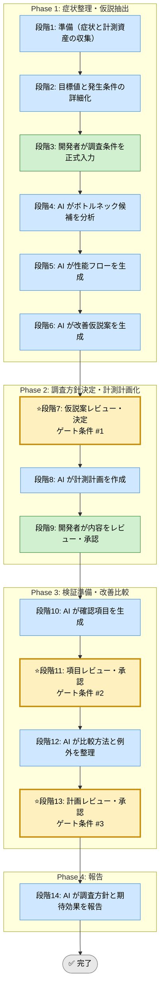

# 性能調査 Skill（統合フレームワーク）

## 利用する場面
- レスポンスや処理時間の遅さを調査したい
- 計測に基づいて改善したい
- 仮説と検証順序を整理したい
- 改善の根拠を残したい

## 対応の流れ（高レベル）

## 実行モード（推奨: balance）
| モード | 特徴 | 用途 |
|--------|------|------|
| strict | 広い計測と複数比較を行う | 深刻な性能劣化 |
| speed | 最小限の仮説と計測に絞る | 早期トリアージ |
| balance | 計測コストと改善効果を両立する | 標準的な性能調査 |

## Phase（段階）の概要
### Phase 1: 症状整理・仮説抽出（段階1-6）
### Phase 2: 調査方針決定・計測計画化（段階7-9）
### Phase 3: 検証準備・改善比較（段階10-13）
### Phase 4: 報告（段階14）

## ゲート条件と承認フロー
### 段階7: 仮説案決定ゲート
判定条件:
- 症状と目標値が明確か
- 仮説と計測方法が対応しているか
- 優先順位が妥当か

### 段階11: 項目承認ゲート
判定条件:
- 計測項目と比較条件が明確か
- 再現条件が揃っているか
- 外的要因の扱いが決まっているか

### 段階13: 計画承認ゲート
判定条件:
- 期待効果が説明可能か
- 計測コストが許容範囲か
- 改善案比較ができるか

## 記録・証跡
- 各段階の内容を `AI改善/performance_investigation_${DATE}.md` に append-only で記録する
- 症状、目標値、仮説、計測方法、承認者を明記する

## 入力リファレンス
- 正本: runbook.md
- Phase 1 サブタスク: sub-skills/phase1-investigation.md
- Phase 2 サブタスク: sub-skills/phase2-measurement-planning.md
- Phase 3 サブタスク: sub-skills/phase3-comparison-validation.md
- Phase 4 サブタスク: sub-skills/phase4-reporting.md
- 記録テンプレート: assets/performance-investigation-log-template.md
