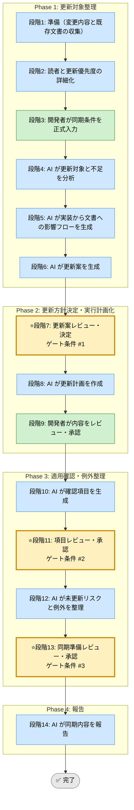

# ドキュメント同期 Skill（運用フレームワーク）

## 利用する場面
- 実装変更に追従して文書を更新したい
- どの文書をどこまで直すべきか整理したい
- 更新漏れや陳腐化を防ぎたい
- 更新タイミングと責任を明確にしたい

## 対応の流れ（高レベル）

## 実行モード（推奨: balance）
| モード | 特徴 | 用途 |
|--------|------|------|
| strict | 読者、導線、周辺資料まで広く更新対象を確認する | 大きな仕様変更 |
| speed | 必須文書に絞って更新漏れを防ぐ | 小規模変更 |
| balance | 読者影響と更新コストを両立する | 標準的な文書同期 |

## Phase（段階）の概要
### Phase 1: 更新対象整理（段階1-6）
### Phase 2: 更新方針決定・実行計画化（段階7-9）
### Phase 3: 適用確認・例外整理（段階10-13）
### Phase 4: 報告（段階14）

## ゲート条件と承認フロー
### 段階7: 更新案決定ゲート
判定条件:
- 変更影響を受ける文書が整理されているか
- 読者と優先度が明確か
- 更新しない文書の理由があるか

### 段階11: 項目承認ゲート
判定条件:
- 更新対象と更新内容が対応しているか
- 更新タイミングと責任が明確か
- 例外項目が管理されているか

### 段階13: 同期準備承認ゲート
判定条件:
- 未更新リスクが見えているか
- 後続フォローが定義されているか
- 読者にとって十分な更新になっているか

## 記録・証跡
- 各段階の内容を `AI改善/documentation_sync_${DATE}.md` に append-only で記録する
- 対象文書、更新優先度、例外、承認者を明記する

## 入力リファレンス
- 正本: runbook.md
- Phase 1 サブタスク: sub-skills/phase1-guideline-definition.md
- Phase 2 サブタスク: sub-skills/phase2-execution-planning.md
- Phase 3 サブタスク: sub-skills/phase3-feedback-and-adjustment.md
- Phase 4 サブタスク: sub-skills/phase4-continuous-improvement.md
- 記録テンプレート: assets/documentation-sync-log-template.md
