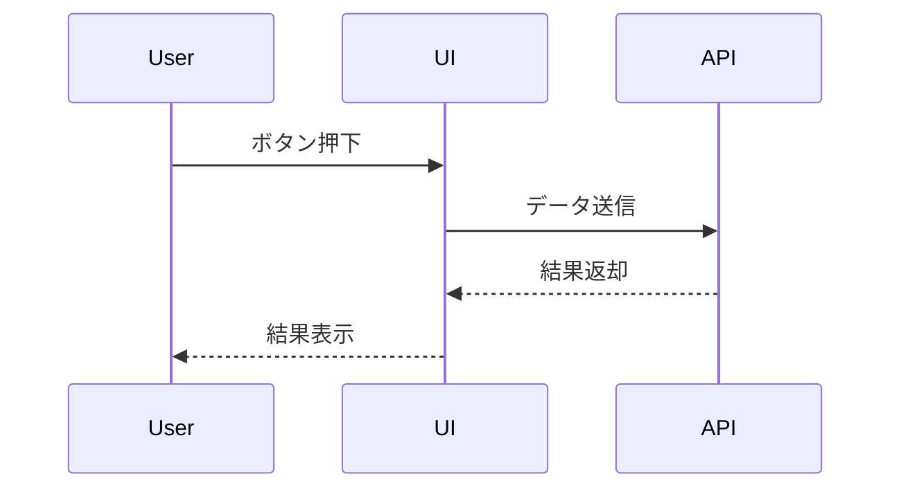
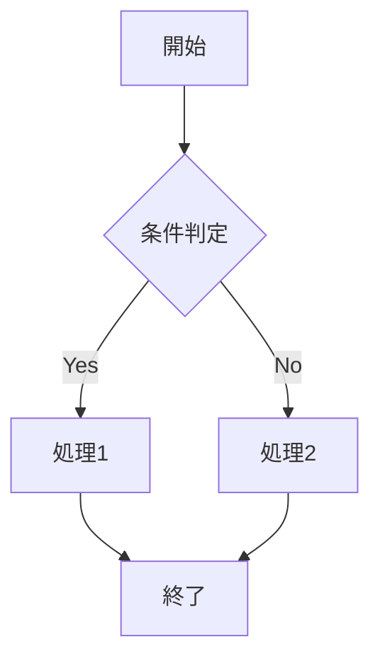

# Copilot Instructions運用ガイド

## 目的・重要性
Copilot Instructions（copilot-instructions.md）は、Skillやリポジトリの自動化・再利用性・品質向上のための明確な指示文です。
曖昧な指示や属人的な運用を防ぎ、誰でも同じ成果を得られることを目指します。

## 運用方針
- Skill新規作成時・大幅改訂時に必ず記載
- 実装者・レビュワー双方が内容を確認し、必要に応じて改善
- 記載内容は簡潔かつ具体的に
- フォルダ構成や命名規則も明記し、初見者が迷わないようにする
- 構成変更時は必ずこのファイルも更新

## 記載例
### 良い例
- 「入力データが不正な場合はエラーを返すこと」
- 「出力はJSON形式で、必ずstatusキーを含めること」
- 「docs/配下にガイド類、shared-templates/配下にテンプレート類を配置する」

### 悪い例
- 「適当に処理する」
- 「いい感じにまとめる」

## ベストプラクティス
- 曖昧な表現を避ける
- 例外処理やエッジケースも明記
- 定期的な見直し・改善を推奨
- 主要ディレクトリごとに「用途」「主なファイル」「関連ドキュメント」などを整理

- Mermaid記法によるシーケンス図・フローチャートの活用を推奨（画面仕様書やAPI仕様書、処理フロー説明などで視覚的に共有）

### Mermaid記法サンプル





## サンプル構成記載

```
リポジトリ構成例（深い階層・番号付き）:

- 010_requirements/
	- 010_business-requirements.md
	- 020_use-cases/
		- 010_use-case-01.md
		- 020_use-case-02.md
- 020_basic-design/
	- 010_domain-analysis.md
	- 020_data-model/
		- 010_er-diagram.png
		- 020_data-dictionary.md
	- 030_ui-design/
		- 010_screen-list.md
		- 020_screen-spec/
			- 010_screenA/
				- 010_elements.md           # 画面要素一覧・説明
				- 020_initial-process.md    # 初期化処理の流れ
				- 030_event-handling.md     # 各イベントの処理仕様
				- 040_sequence-diagram.md   # シーケンス図
				- 050_step-description.md   # ステップごとの説明
	- 040_external-interfaces.md
- 030_detail-design/
	- 010_api-spec/
		- 010_apiA.md
		- 020_apiB.md
	- 020_logic-design/
		- 010_flowcharts/
		- 020_pseudo-code/
- 040_implementation/
- 050_test/
- 060_release/
- docs/                # ガイド・運用資料
- shared-templates/    # テンプレート集
- shared-references/   # ベストプラクティス・用語集
- governance/          # KPI・例外・レビュー記録
```

### 各成果物の記載場所・内容例

- 画面仕様書（020_basic-design/030_ui-design/020_screen-spec/010_screenA/）
	- 010_elements.md：画面要素一覧・説明
	- 020_initial-process.md：初期化処理の流れ
	- 030_event-handling.md：各イベントの処理仕様
	- 040_sequence-diagram.md：画面内・外部連携のシーケンス図
	- 050_step-description.md：ユーザー操作ごとの詳細説明
- 基本設計
	- 010_domain-analysis.md：ドメインモデル・用語定義
	- 020_data-model/：ER図・データ辞書
	- 030_ui-design/：画面一覧・画面遷移図・画面仕様
	- 040_external-interfaces.md：外部システムIF仕様
- 詳細設計
	- 010_api-spec/：API仕様書
	- 020_logic-design/：ロジック設計（フローチャート・疑似コード等）

※ 番号は工程・成果物の流れを明確にし、並び順を安定させるために付与します。


## 参考
- flowchart-best-practices.md
- ERD-best-practices.md
- skills/README.md
