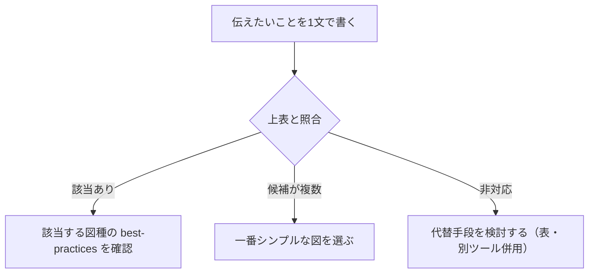

# 開発フェーズ×図カタログ ガイド

各 Skill の成果物にどの図（Mermaid/Graphviz）を使うかを、フェーズと成果物から逆引きするための索引です。
個々の構文詳細は各図種の best-practices ファイル、またはより広い教材（`diagram-as-code-tutorial` リポジトリの `docs/06-project-phase-diagrams/`）を参照してください。

## 利用方法

- **対象**: 各 Skill の設計系段階（要件整理、方式案検討、詳細設計、テスト設計、リリース計画など）で、成果物に添える図を選ぶ場面
- **使い方**: 「フェーズ」列で該当する Skill を探し、「成果物」列で作ろうとしている図に近いものを探す
- **原則**: 表にない成果物は、[図の選び方（目的から逆引き）](#図の選び方目的から逆引き)で目的から図種を選ぶ

---

## フェーズ×成果物×図 全体マッピング表

| フェーズ（対応 Skill） | 成果物 | 図の種類 | 備考 |
|---|---|---|---|
| 要件・計画（[010_requirements-refinement](../010_requirements-and-planning/010_requirements-refinement/SKILL.md)） | 業務フロー図 | flowchart | 担当者ごとのグルーピングは `subgraph` で代用（スイムレーン） |
| 要件・計画 | 概念データモデル | erDiagram | 属性は書かず関連整理に集中。詳細化は設計・実装フェーズの ER 図で行う |
| 要件・計画 | 要件優先度マトリクス | quadrantChart | 影響度×工数の2軸 |
| 要件・計画 | ユースケース図 | 非対応（flowchart で代替） | 専用記法なし。アクターとユースケースをノードで表現 |
| 設計・実装（[020_architecture-decision-record](../020_design-and-implementation/020_architecture-decision-record/SKILL.md)） | システム構成図（シンプル） | flowchart | 主要コンポーネントの関係を素早く共有 |
| 設計・実装 | システム構成図（複雑・外部連携多数） | Graphviz DOT | クラスタで自動レイアウト。判断基準は[Mermaid vs Graphviz](#mermaid-vs-graphviz-の判断基準) |
| 設計・実装（[040_data-model-design-unified](../020_design-and-implementation/040_data-model-design-unified/SKILL.md)） | ER図（論理・属性付き） | erDiagram | 詳細は[erd-best-practices.md](./erd-best-practices.md) |
| 設計・実装（[050_feature-implementation-unified](../020_design-and-implementation/050_feature-implementation-unified/SKILL.md)） | 方式案の処理フロー図 | flowchart | 詳細は[flowchart-best-practices.md](./flowchart-best-practices.md) |
| 設計・実装 | 処理シーケンス図（画面/API/バッチ間のやり取り） | sequenceDiagram | 詳細は[sequence-diagram-best-practices.md](./sequence-diagram-best-practices.md) |
| 設計・実装（[010_api-contract-design](../020_design-and-implementation/010_api-contract-design/SKILL.md)） | API呼び出しシーケンス | sequenceDiagram | クライアント/API/バックエンド間の呼び出し順序を明示 |
| 設計・実装 | クラス図 | classDiagram | 詳細設計でメソッドまで含めて実装レベルに近づける |
| 設計・実装 | ステートマシン図・画面遷移図 | stateDiagram-v2 | 複合状態（`state X { ... }`）でサブ状態を表現可能 |
| 設計・実装 | DFD（データフロー図） | Graphviz DOT | Mermaid 非対応。`shape=box/ellipse/box3d` で外部エンティティ/プロセス/データストアを代替表現 |
| 検証・品質（[030_test-strategy-unified](../030_verification-and-quality/030_test-strategy-unified/SKILL.md)） | テストケース分岐図 | flowchart | デシジョンテーブルの条件組み合わせを可視化 |
| 検証・品質 | テストスケジュール | gantt | タスクの依存関係・期間を時系列で共有 |
| 検証・品質（[010_defect-repair-unified](../030_verification-and-quality/010_defect-repair-unified/SKILL.md)） | 対応前/対応後フロー | flowchart | 詳細は[flowchart-best-practices.md](./flowchart-best-practices.md) |
| 運用・リリース（[030_release-readiness](../040_operations-and-release/030_release-readiness/SKILL.md)） | デプロイフロー図 | flowchart | ビルド〜デプロイ〜検証の分岐とロールバック経路を含める |
| 運用・リリース | インフラ構成図（シンプル冗長構成） | Mermaid architecture-beta | v11.1+ 必須。組込アイコンは cloud/database/disk/internet/server の5種のみ |
| 運用・リリース | インフラ構成図（複雑・サブネット等） | Graphviz DOT | クラスタで自由な階層表現 |
| 運用・リリース | ブランチ戦略図 | gitGraph | ブランチの分岐・マージ・リリースタグを可視化 |
| 運用・リリース（[010_observability-and-ops-readiness](../040_operations-and-release/010_observability-and-ops-readiness/SKILL.md)） | 障害対応フロー | flowchart | 検知→影響判定→エスカレーション→復旧確認→報告 |
| 学習・改善（[020_incident-postmortem](../050_learning-and-improvement/020_incident-postmortem/SKILL.md)） | 障害対応フロー・タイムライン | flowchart / timeline | 時系列の俯瞰には `timeline`（実験的機能） |

「非対応」の項目は隠さず明記します。Mermaid/Graphviz の限界を理解した上で、必要に応じて他ツール（表、専用UMLツール等）と併用してください。

---

## 図の選び方（目的から逆引き）

| 伝えたいこと | 適した図 |
|---|---|
| 処理の流れ・分岐 | flowchart |
| 誰が何をいつ呼び出すか（時系列のやり取り） | sequenceDiagram |
| オブジェクトの構造・関係 | classDiagram |
| 状態の遷移 | stateDiagram-v2 |
| データの構造・関連 | erDiagram |
| スケジュール | gantt |
| 開発フェーズ全体のロードマップ | timeline |
| 要件と実装の対応 | requirementDiagram |
| 大規模・複雑な構造（外部連携多数、サブネット等） | Graphviz DOT |

判断フロー:

## Mermaid vs Graphviz の判断基準

- コンポーネント数が少なく、関係がシンプル → Mermaid（flowchart）で十分
- 外部連携・階層・クラスタが多く、自動レイアウトが崩れやすい → Graphviz DOT のクラスタ機能を使う
- 同じ成果物でも規模に応じて両方使い分けてよい（例: システム構成図はシンプルなら flowchart、複雑なら Graphviz）

## 参照優先順位（競合時）

各図種の best-practices ファイル（flowchart-best-practices.md, erd-best-practices.md, sequence-diagram-best-practices.md）＞ 本ガイドのマッピング表 ＞ 元教材（diagram-as-code-tutorial）

---

**最終更新**: 2026-08-22
**ガイドライン版**: 1.0
