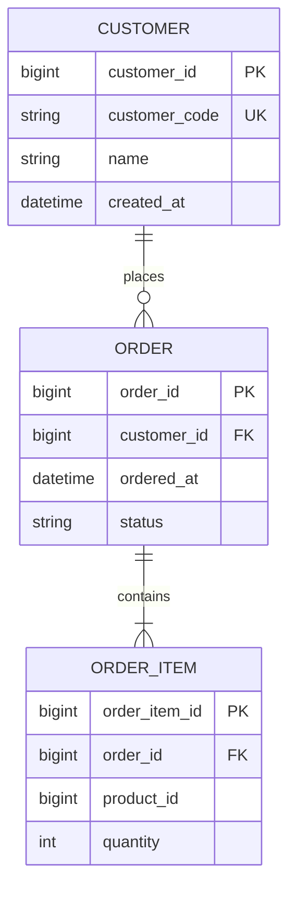

# ERD 作成ガイドライン（ERD Best Practices）

省略用語（RACI, KPI, ADR, DDL, SLO, QA, PM, TRK, EX）は [glossary.md](glossary.md) の『略語・日本語対応表』を参照してください。

本ガイドは、データモデル設計時に使用する ERD（Entity Relationship Diagram）の作成基準です。

## 利用方法
- 対象: データモデル設計の Phase 1-2
- 出力形式: Mermaid erDiagram
- 記録方法: docs/skill-logs/ ログファイルにコードを保存

---

## 基本原則
1. ERD は要件IDに対応する業務概念を優先して表現する
2. エンティティ名は単数形の業務用語を使う
3. 関係はカーディナリティを必ず明示する
4. 属性は最小限から始め、後段で拡張する

## 命名規則
- Entity: PascalCase（例: Order, Customer）
- Column: snake_case（例: order_id, created_at）
- PK: <entity>_id
- FK: <referenced_entity>_id

## カーディナリティ表記（Mermaid）
- 1:1: `||--||`
- 1:N: `||--o{`
- 0..1: `|o--||`
- N:M: 中間テーブルで分解する

## 推奨チェック項目
- [ ] すべてのエンティティに主キーがある
- [ ] FK 関係が循環しすぎていない
- [ ] NULL 可否が業務ルールと一致している
- [ ] 一意制約が重複データ防止に効いている
- [ ] 更新頻度の高い検索条件に索引方針がある

## Mermaid テンプレート

## 正規化・非正規化の判断
- 正規化優先: 更新整合性が重要な場合
- 非正規化許容: 読み取り性能がボトルネックの場合
- 非正規化を採用する場合は、更新責務と同期手段を明記する

## レビュー観点
1. 要件IDとエンティティの対応が説明できるか
2. API 契約の主要項目と整合しているか
3. DDL 方針と矛盾がないか
4. 移行計画で取り扱えない破壊的変更が残っていないか
