# Mermaid かように作成ガイドライン（Flowchart Best Practices）

本ガイドは、Phase 1「調査・分析・対応案決定」（段階5）で使用する処理フロー図（Mermaid形式）の作成基準です。

## 利用方法
- **対象**: 段階5「AI が処理フロー図を生成」で、統一的な図表を作成
- **出力形式**: Mermaid Flowchart（Markdown コード ブロック内）
- **粒度**: 「不具合発生点⇔対応前後の差」レベル

---

## フロー設計の基本原則

### 1. 目的の明確化

#### 対応前フロー（問題がある処理）
```
目的: 不具合が発生する処理パスを可視化
内容: 
  - 入力から不具合発生点まで
  - 分岐・条件判定
  - 例外ハンドリング（あれば）
```

#### 対応後フロー（改修後の処理）
```
目的: 不具合を回避する改善方法を可視化
内容:
  - 対応前フロー との差分
  - 追加の判定ステップ
  - エラーハンドリングの強化
```

---

## ノード・シェイプの使い分け

### ノード種別と記号

| ノード種別 | Mermaid 記号 | 用途 | 例 |
|----------|------------|------|-----|
| **処理** | `[テキスト]` | 通常の処理ステップ | `[DB読取]` |
| **判定** | `{テキスト}` | 条件分岐 Yes/No | `{NULL判定}` |
| **データ** | `([テキスト])` | 入出力データ | `([DS Telegram])` |
| **開始/終了** | `([テキスト])` / `([終了])` | フロー始終 | `([開始])` |
| **エラー** | `❌ テキスト` | 例外発生 | `❌ InvalidCastException` |
| **結果** | `✓ テキスト` | 正常終了 | `✓ Result出力` |

### カラーリング（視認性向上）

```
スタイル付与例:
- 問題がある箇所: 赤
- 改修後の追加処理: 青/緑
- 判定ポイント: 黄
```

**Mermaid CSS サンプル**:
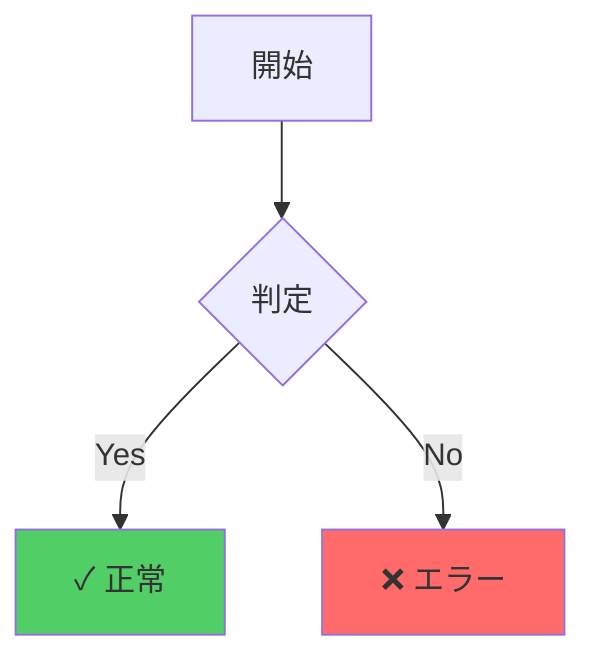

---

## 対応前フロー（Problem Flow）の設計

### 例：DBNull 起因のキャスト例外

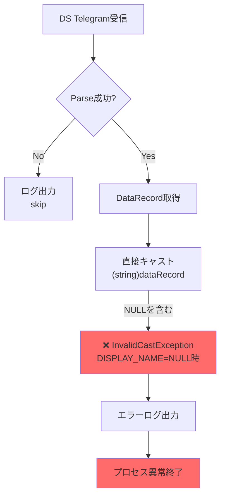

### ポイント

1. **エントリーポイント明示** — 「DS Telegram受信」から開始
2. **分岐の可視化** — Parse成功/失敗 の分岐
3. **問題箇所の強調** — ❌ マーク + 赤色で不具合点を明示
4. **結果の表示** — 「プロセス異常終了」で終了状態を明確化

---

## 対応後フロー（Solution Flow）の設計

### 同じシナリオで改修後

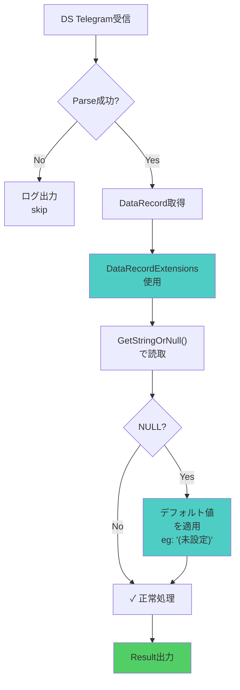

### ポイント

1. **対応前との差分を強調** — 青色で新規ステップ（DataRecordExtensions, NULL判定, デフォルト値）
2. **分岐の詳細化** — NULL判定による分岐を明示
3. **正常終了の明確化** — ✓ マーク + 緑色
4. **入出力の一貫性** — 対応前フローと同じ入出力

---

## 複数対応案のフロー表現

対応案が複数ある場合、各案の差分を並べて比較することが効果的です。

### 対応案1: DataRecordExtensions置換

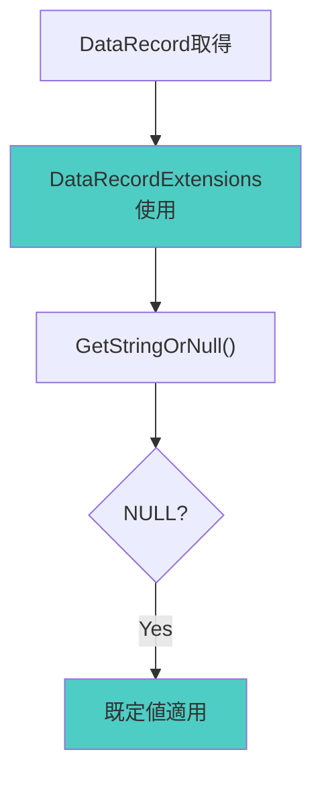

### 対応案2: 層厚い NULL判定

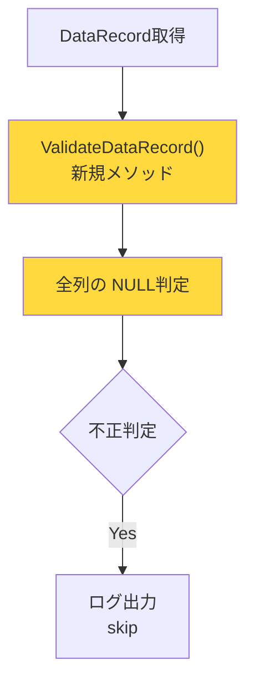

---

## フロー図に含むべき要素

### 必須要素
- [ ] 開始ポイント（入力データ）
- [ ] 主要業務ロジック（核となる処理）
- [ ] 判定・分岐ポイント
- [ ] エラーハンドリング箇所
- [ ] 終了ポイント（出力 / 正常 / 異常）

### 推奨要素
- [ ] ポイントごとのアノテーション（重要な条件等）
- [ ] データの型情報（必要に応じて）
- [ ] スループット / タイムアウト情報（パフォーマンス観点）
- [ ] インタフェース先（他プロセス、DB等）

### 省略してよい要素
- [ ] 内部ルーチン詳細（別途フロー図があれば）
- [ ] 変数名（処理内容で十分）
- [ ] UI要素（非ビジュアルシステムの場合）

---

## Mermaid コード例（テンプレート）

### 最小限のテンプレート

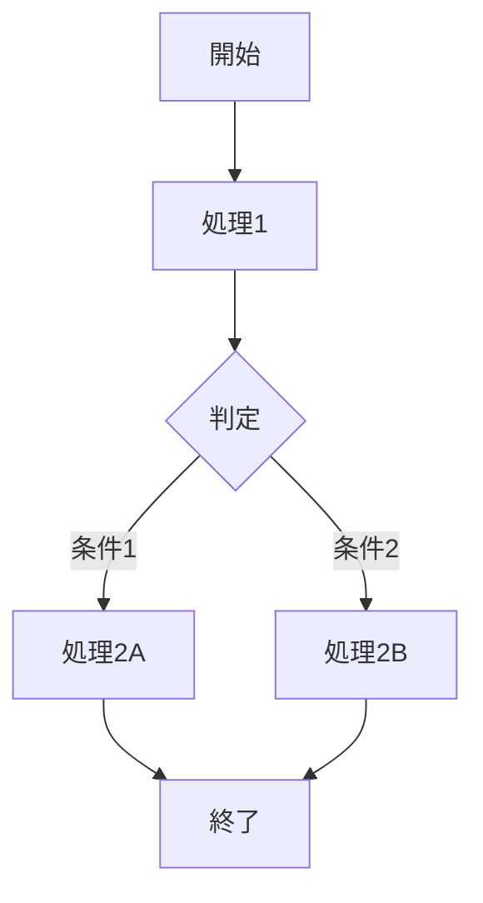

### リッチな装飾例

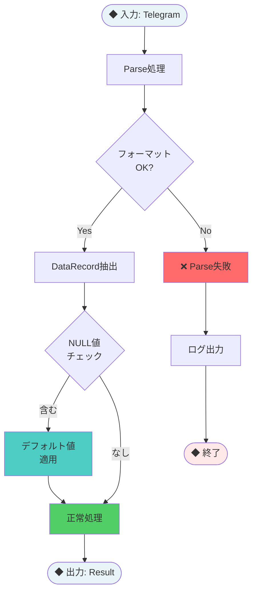

---

## よくある間違いと改善例

### ❌ 間違い 1: ノードが大きすぎる

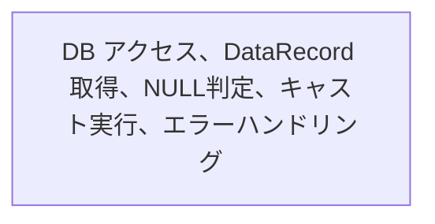

### ✓ 改善: 適切な粒度に分割

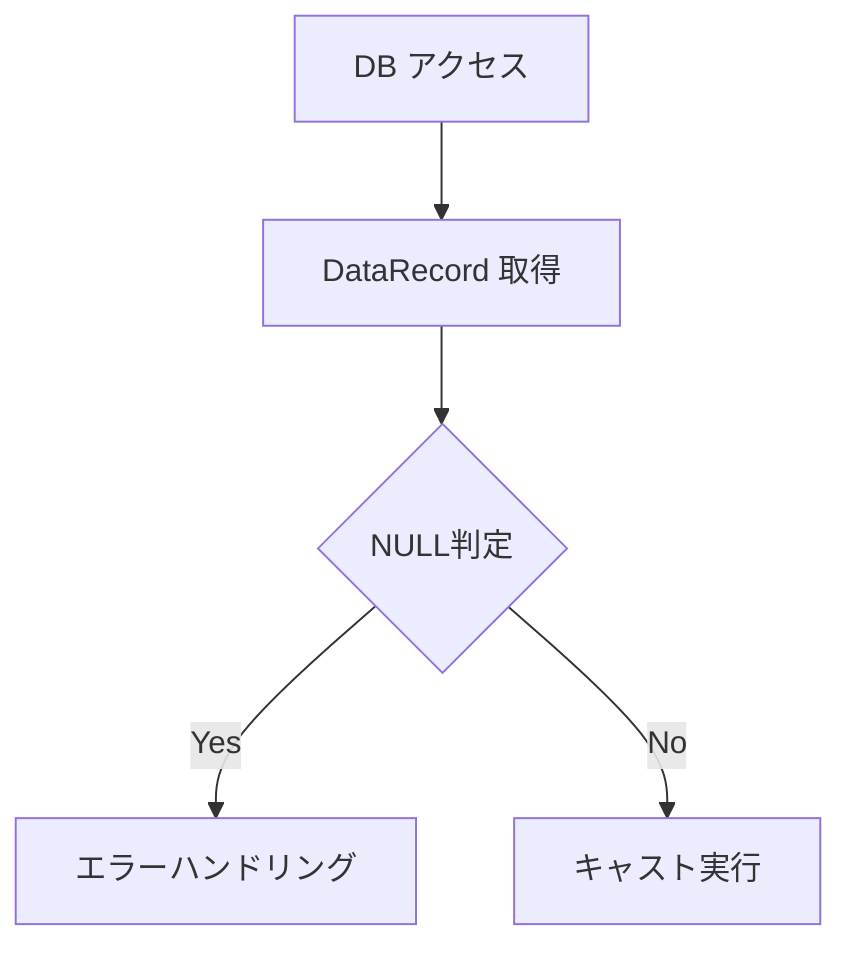

---

### ❌ 間違い 2: 線が複雑に絡んでいる

```mermaid
flowchart TD
    A --> B
    A --> C
    B --> D
    C --> D
    D --> E
    E --> B  # 循環
    E --> F
```

### ✓ 改善: 階層を明確に

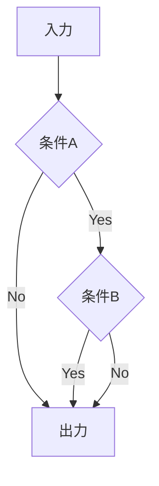

---

### ❌ 間違い 3: 凡例がない

（フロー図内に色や記号の意味が不明）

### ✓ 改善: 凡例を添付

```
凡例:
- 赤（❌）= エラー発生点
- 青/緑 = 改修後の追加処理
- 黄 = 判定ポイント
- ✓ = 正常終了
```

---

## フロー図の命名・保管

### ファイル形式
- **Markdown コード ブロック内**に `mermaid` 言語タグで記載
- **docs/skill-logs/ ログファイル**に embed、または **separate markdown ファイル**として保管

### 命名規則

```
flowchart_[対象モジュール]_[対応前or対応后].md

例:
flowchart_ProcDataSync_before.md
flowchart_ProcDataSync_after_plan1.md
```

### 参照関係

```
Phase 1 Sub-Skill (phase1-investigation.md)
  └─> 段階5 で 対応前フロー + 対応後フロー(複数案) を生成
  └─> docs/skill-logs/ ログ に embed
```

---

## チェックリスト: フロー図の品質確認

デプロイ前に以下をチェックしてください:

- [ ] 開始ポイント（入力）が明示されているか
- [ ] 終了ポイント（出力 or エラー）が明示されているか
- [ ] 不具合発生点が ❌ で強調されているか（対応前フロー）
- [ ] 改修内容が色分けで強調されているか（対応後フロー）
- [ ] 判定ポイント が全て {Yes/No} で明示されているか
- [ ] 線が複雑に絡んでいないか（メンテナンス性）
- [ ] ノードの粒度が統一されているか
- [ ] 凡例（色、記号の意味）が明確か
- [ ] Markdown がレンダリングされるか（確認）
- [ ] 対応案複数の場合、各案の差分が可視化されているか

---

## 参考リソース

### Mermaid 公式ドキュメント
- https://mermaid.js.org/syntax/flowchart.html
- Flowchart 構文、スタイリング、サブグラフ等の詳細

### よくある Mermaid スタイル

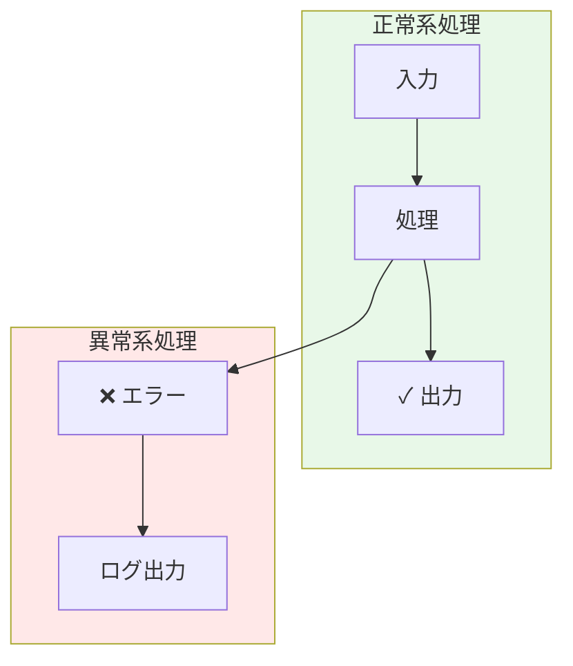

---

**最終更新**: 2026-03-27  
**ガイドライン版**: 1.0
