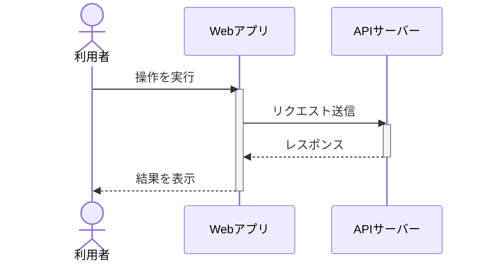
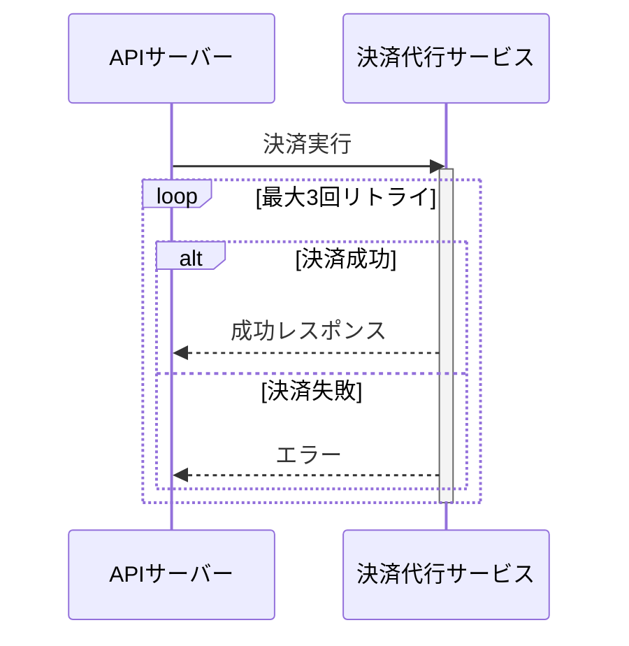

# Mermaid シーケンス図 作成ガイドライン（Sequence Diagram Best Practices）

本ガイドは、機能設計・実装方針書（処理仕様書）や API 契約書で「誰が・いつ・何を呼び出すか」を
表現する際に使う、Mermaid `sequenceDiagram` の作成基準です。
処理の分岐・条件判定が主目的の場合は [flowchart-best-practices.md](./flowchart-best-practices.md) を、
図種の選定に迷う場合は [diagram-catalog-guide.md](./diagram-catalog-guide.md) を参照してください。

## 利用方法

- **対象**: [050_feature-implementation-unified](../020_design-and-implementation/050_feature-implementation-unified/SKILL.md) の段階5（方式案フロー生成）、[010_api-contract-design](../020_design-and-implementation/010_api-contract-design/SKILL.md) のエンドポイント間呼び出し設計
- **出力形式**: Mermaid sequenceDiagram（Markdown コードブロック内）
- **使いどころ**: 単一処理の分岐（flowchart）ではなく、複数の登場人物（画面/API/外部サービス/DB等）間の時系列のやり取りを明確にしたいとき

---

## 基本文法

### 登場人物の宣言

| 記法 | 意味 |
|---|---|
| `participant X` | システム・コンポーネントなど |
| `participant X as 表示名` | 表示名を指定 |
| `actor X as 表示名` | 人型アイコン（利用者など） |

### メッセージ矢印

| 記法 | 意味 |
|---|---|
| `->>` | 実線・依頼/リクエストメッセージ |
| `-->>` | 破線・応答/レスポンスメッセージ |
| `activate X` / `deactivate X` | 処理中区間を帯で表示 |

### 繰り返し・条件分岐

| 記法 | 意味 |
|---|---|
| `loop ラベル ... end` | 繰り返し区間（例: リトライ） |
| `alt 条件A ... else 条件B ... end` | 条件分岐 |
| `opt ラベル ... end` | 任意実行区間（分岐先が1つのみ） |

---

## 基本形の例

### ポイント

1. **アクターとシステムを区別** — 人は `actor`、システム・コンポーネントは `participant`
2. **処理中区間を明示** — `activate`/`deactivate` で「今どこが処理中か」を可視化
3. **応答は破線** — `-->>` で依頼（`->>`）と応答を視覚的に区別する

---

## リトライ・分岐を含む例（詳細シーケンス図）

外部サービス呼び出しの失敗時リトライなど、実装の詳細を含める場合の例です。

### ポイント

1. **`loop` の中に `alt` を入れ子にする** — リトライ処理と分岐を同時に表現できる
2. **ラベル文字列はそのまま図に表示される** — 「最大3回リトライ」のように条件を具体的に書く
3. **基本設計のシーケンス概要図との違いを意識** — 概要図は主要な呼び出しのみ、詳細シーケンス図はリトライ・エラー処理まで含める

---

## 図に含むべき要素

### 必須要素
- [ ] 起点となる登場人物（利用者 or 外部トリガー）
- [ ] 主要な呼び出し・応答の流れ
- [ ] 処理中区間（`activate`/`deactivate`）
- [ ] エラー・異常系の応答（あれば `alt` で分岐）

### 推奨要素
- [ ] リトライ・タイムアウトなど実装上重要な制御構造（`loop`）
- [ ] 非同期処理であることが分かるラベル（同期/非同期の区別）

### 省略してよい要素
- [ ] 内部ロジックの詳細（別途フロー図があれば）
- [ ] 単純な直列呼び出ししかない場合の `activate`/`deactivate`（過剰な装飾は避ける）

---

## よくある間違いと改善例

### ❌ 間違い1: participant と actor を混同する

システムコンポーネントに `actor` を使うと人型アイコンになり誤解を招く。

### ✓ 改善: 人には `actor`、システムには `participant` を使う

### ❌ 間違い2: 登場人物が多すぎて読みにくい

5人以上の登場人物を1つの図に詰め込むと視認性が落ちる。

### ✓ 改善: 概要シーケンス図（主要な流れ）と詳細シーケンス図（個別処理のリトライ等）を分ける

### ❌ 間違い3: 応答メッセージも実線 `->>` で書いてしまう

依頼と応答の区別がつかなくなる。

### ✓ 改善: 依頼は `->>`、応答は `-->>` で統一する

---

## flowchart との使い分け

| 表現したいこと | 図種 |
|---|---|
| 単一処理内の条件分岐・ループ | flowchart |
| 複数コンポーネント間の時系列のやり取り | sequenceDiagram |
| 両方必要な場合 | 処理フロー図（flowchart）+ 処理シーケンス図（sequenceDiagram）を併記 |

---

## チェックリスト: シーケンス図の品質確認

- [ ] 登場人物が `actor`/`participant` で適切に区別されているか
- [ ] 依頼（`->>`）と応答（`-->>`）が区別されているか
- [ ] 処理中区間が `activate`/`deactivate` で示されているか
- [ ] リトライ・分岐がある場合、`loop`/`alt` で表現されているか
- [ ] 登場人物が多すぎないか（概要図/詳細図の分割を検討したか）
- [ ] Markdown がレンダリングされるか（確認）

---

## 参考リソース

### Mermaid 公式ドキュメント
- https://mermaid.js.org/syntax/sequenceDiagram.html

---

**最終更新**: 2026-08-22
**ガイドライン版**: 1.0
