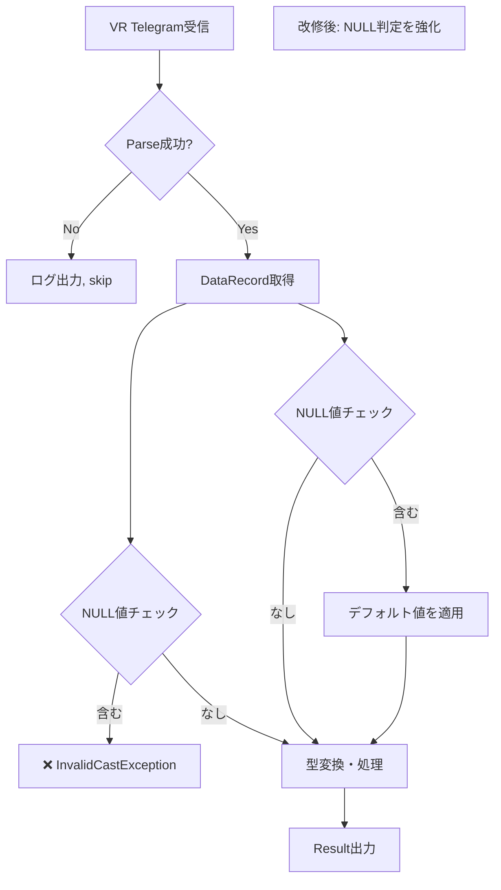

# 不具合対応 Runbook（詳細手順・判定基準）

## はじめに

このRunbookは「汎用不具合対応Skill（統合フレームワーク）」の正本です。14段階にわたる不具合対応の詳細手順、判定基準、記録項目を定義します。

### 参照優先順位
```
実装ファイル（csproj/DDL/ログ等） ＞ 本Runbook ＞ SKILL.md ＞ 実行ログ
```

SKILL.md と本Runbook の記載が不一致の場合は、**本Runbook を正とします**。

---

## Phase 1: 調査・分析・対応案決定

### 段階1: 準備（初期情報収集）
**目的**: 対応開始の事前準備、関連ファイル・ドキュメントの確認

**入力**:
- 不具合チケット情報（ID, title, 報告者, 日時）
- プロジェクト文脈（対象モジュール、バージョン）

**作業**:
1. 対象プロジェクト（ProcXXX, SkdXXX, Lib*, Sim* など）を特定
2. csproj ファイルを確認（TargetFramework, 依存 DLL）
3. 関連 DDL（DB スキーマ）を確認（対象テーブルの列定義、NULL可否）
4. 既存ユニットテスト / 統合テストの有無を確認
5. 関連ログファイルの保管場所を確認

**出力**:
- 対象プロジェクト一覧
- 関連ファイルパス（csproj, DDL, テスト, ログ）
- 初期文脈（プロジェクト構成、技術スタック）

**判定基準**:
- 対象プロジェクトが特定できたか ✓
- 関連ファイル（少なくとも csproj と DDL）にアクセス可能か ✓

**次段階**: 段階2 へ進む

---

### 段階2: 不具合内容の詳細化
**目的**: 不具合の症状・影響範囲・環境を明確化

**入力**:
- 開発者からの不具合描述（症状, 発生条件, 環境, 影響範囲）
- 再現ステップ（あれば）

**作業**:
1. **症状の明確化**
   - エラーメッセージ、エラーコード、stack trace の抽出
   - 正常系との差分（期待動作 vs 実際の動作）

2. **発生条件の特定**
   - どのプロセス / モジュールで発生するか
   - 特定のデータ / ユーザー / 時間帯に限定されるか
   - 再現可能性（100%再現 / 稀に発生）

3. **影響範囲の算定**
   - 1つのモジュール内か / 複数モジュール間か
   - 他の機能への連鎖影響か
   - ビジネス影響度（クリティカル / 重大 / 軽微）

4. **環境情報の確認**
   - OS, .NET version, DB version
   - ネットワーク環境（ローカル / 実運用）

**出力**:
- 不具合詳細シート（症状, 発生条件, 影響範囲, 環境, 再現ステップ）

**判定基準**:
- 症状が客観的に記述されているか（推測でなく、logs / error の根拠あり） ✓
- 影響範囲が特定できたか ✓
- 再現ステップが明示されているか（稀発の場合は「発生傾向」で可） ✓

**次段階**: 段階3 へ進む

---

### 段階3: 開発者が不具合内容を入力
**目的**: 開発者による不具合内容の正式な入力

**入力条件**:
- 段階2 の不具合詳細シートが完成していること

**開発者の作業**:
1. 不具合タイトルを記述
   - 形式: `[Module] Symptom（エラー内容、機能名）`
   - 例: `[ProcForEtgs] InvalidCastException when processing xxx telegram`

2. 症状を記述（日本語でも英語でも可）
   - 初期症状
   - 前後のプロセス状態
   - ログ出力内容

3. 環境・影響範囲を記述
   - テスト環境 / 本番環境
   - 複数プロセス影響の有無

4. 再現ステップを記述（あれば）

**記録**:
- `AI改善/defect_repair_${CATEGORY}_${DATE}.md` に開始ログを記載
  ```
  ## 段階3: 開発者が不具合内容を入力（2026-03-27 14:30:00 +09:00）

  ### 不具合タイトル
  [ProcForEtgs] InvalidCastException when processing VEHICLE_REGISTRATION telegram

  ### 症状
  - エラー内容: InvalidCastException in DataRecord.GetXxx()
  - 発生タイミング: VEHICLE_REGISTRATION telegram 受信時
  - 影響: ProcForEtgs プロセスが異常終了

  ### 環境
  - .NET: 8.0-windows
  - DB: PostgreSQL 15

  ### 再現ステップ
  1. 特定形式の VR telegram を送信
  2. ProcForEtgs で処理開始
  3. エラー出力、プロセス停止

  **承認ステータス**: 未承認（段階4開始前、確認待機）
  ```

**次段階**: 段階4 へ進む

---

### 段階4: AI が原因調査を実施
**目的**: 不具合の根本原因を特定

**入力**:
- 段階3 の不具合入力
- シンボル参照、ログ解析、処理フロー追跡

**調査方法** （優先順）:
1. **ログ解析**
   - Stack trace から発生箇所を特定
   - 前後のログで処理フロー追跡
   - 条件分岐・依存関係を確認

2. **実装ファイルの確認**
   - 該当メソッド・クラスのソースコード確認
   - 依存ライブラリ（Npgsql, Newtonsoft.Json等）の使用パターン確認
   - 既知の脆弱性パターン（例: DBNull 起因のキャスト例外）を検査

3. **DDL 確認**
   - 対象テーブルの列定義（NULL可否, データ型）
   - SQL の JOIN 種別（INNER / LEFT / RIGHT）
   - デフォルト値の有無

4. **テスト結果 / 既知問題の確認**
   - 既出のユニットテスト失敗例
   - 類似の過去改修例がないか

5. **仮説立案と優先順付け**
   - 複数の仮説がある場合、尤度の高い順に列挙
   - 各仮説の検証方法を明示

**出力**:
- 原因候補一覧（仮説1, 仮説2, 仮説3...）
- 各候補の尤度・根拠
- 検証シーケンス（どの検証から進めるか）

**判定基準**:
- stack trace から発生箇所が特定できたか ✓
- 候補が複数あれば、尤度の高い順に並べられているか ✓
- 各候補の根拠（実装ファイル、DDL、ログ）が示されているか ✓

**次段階**: 段階5 へ進む

---

### 段階5: AI が処理フロー図を生成
**目的**: 不具合発生点と対応前後の差をMermaid図で可視化

**フロー設計基準** （「不具合発生点⇔対応前後の差」レベル）:
1. **対応前フロー**
   - 不具合が発生する処理パス
   - 分岐・例外処理の位置
   - データの変換・キャスト箇所

2. **対応後フロー（複数案がある場合は、対応案ごと）**
   - 不具合を回避する処理パス
   - 例外処理の追加
   - 代替処理の位置

3. **重要なノード**
   - DB アクセス（SELECT, INSERT, UPDATE）
   - キャスト・型変換
   - 例外ハンドリング
   - ログ出力

**Mermaidサンプル** (対応前 / 対応後の比較):


**出力**:
- Mermaidダイアグラム（対応前フロー）
- Mermaidダイアグラム（対応後フロー）- 複数案がある場合は各案ごと
- フロー図上のアノテーション（発生点、対応点、判定基準）

**判定基準**:
- フロー図が実装コードの処理パスと一致しているか ✓
- 不具合発生点が明示されているか ✓
- 対応前後の差が可視化されているか ✓

**次段階**: 段階6 へ進む

---

### 段階6: AI が対応案を生成
**目的**: 複数の対応案を検討し、各案のメリット/デメリットを明示

**対応案の検討観点**:
1. **技術的観点**
   - コード変更の最小性（影響範囲）
   - 既存テストとの整合性
   - パフォーマンス変化

2. **運用的観点**
   - 他のモジュール・機能への影響
   - ロールバック可能性
   - 本番環境への展開リスク

3. **保守性観点**
   - コード可読性
   - 同様の問題の再発防止性
   - ドキュメント整備の必要性

**最低3案を提示**: Tech-only案、運用バランス案、保守重視案など

**対応案テンプレート**:
```
#### 対応案 1: [案名（簡潔に）]

**概要**: 
[3-4行で処置内容を説明]

**実装方法**:
- 変更対象ファイル: [ファイルパス]
- 変更概要: [before / after のコード概要]
- 変更規模: [行数概算]

**メリット**:
✓ [技術メリット]
✓ [運用メリット]
✓ [保守メリット]

**デメリット**:
✗ [懸念点]
✗ [リスク]

**テスト対象**:
- [ユニットテスト対象メソッド]
- [統合テスト対象シナリオ]

**推定工数**: [ 工数（相対値）]

---
```

**出力**:
- 対応案 1, 2, 3...（各案のメリット/デメリット付き）
- 各案の実装規模・リスク水準
- 推奨案の提示（ただし決定権は開発者）

**判定基準**:
- 最低3案が提示されているか ✓
- 各案について、メリット/デメリットが具体的か ✓
- テスト対象が明示されているか ✓
- 対応案と段階5のフロー図が対応しているか ✓

**次段階**: 段階7（開発者による対応案決定）へ進む

---

## Phase 2: 実装決定・実施機能

### 段階7: 開発者が対応案をレビュー・決定 ⭐️ **ゲート条件 #1**
**目的**: 開発者が対応案を評価し、実装する案を決定

**開発者の作業**:
1. 段階6 の対応案を検討（複数案のメリット/デメリット比較）
2. 技術的・運用的に最適な案を選定
3. 決定根拠を記録

**ゲート条件** （進行可否判定）:
- [ ] 段階6 の対応案が十分な品質で提示されているか（複数案 + メリット/デメリット）
- [ ] 開発者が対応案を理解し、判断できる情報量があるか
- [ ] 決定が可能な状態であるか（情報不足の場合は段階6 返却）

**記録**:
```
## 段階7: 開発者が対応案をレビュー・決定（2026-03-27 15:00:00 +09:00）

### レビュー結果
**選定案**: 対応案 2（運用バランス案）

**決定根拠**:
- 技術的に最小限の変更で、既存テストをカバーできる
- 本番環境への展開リスクが低い
- 類似問題の回避パターンが確立している

**懸念事項**:
- [あれば記載]

**承認ステータス**: ✓ 承認済

---
```

**次段階**: 段階8 へ進む

---

### 段階8: AI が改修を実施
**目的**: 決定した対応案に基づいて、ソースコード変更を実施

**実装前確認**:
- 段階7 で選定された対応案を確認
- 変更対象ファイル、変更内容、テスト対象を再確認

**実装作業**:
1. **対象ファイルの変更**
   - 対応案で明示された変更を実装
   - コードスタイル・命名規則をプロジェクト規約に従う
   - コメントを適切に追加

2. **関連ファイルの確認**
   - テストファイル（xxxTest.csproj）の確認
   - 既存テストの実施可能性を確認

3. **ビルド可能性の確認**
   - devenv or dotnet build で対象プロジェクトがビルド可能か
   - 依存プロジェクトも合わせてビルド確認

**出力**:
- 変更ファイル一覧（ファイルパス、変更行数、変更内容概要）
- 差分サマリ（before / after の主要コード）
- ビルド確認ログ（エラー/警告なし）

**変更ファイルテンプレート**:
```
### 変更ファイル 1: [ファイルパス]

**変更概要**: [3-5行で変更内容を要約]

**Before**:
\`\`\`csharp
[before コード]
\`\`\`

**After**:
\`\`\`csharp
[after コード]
\`\`\`

**変更理由**: [対応案のどこに対応するか]

---
```

**判定基準**:
- 実装が対応案と一致しているか ✓
- ビルドエラー / 警告がないか ✓
- 変更がスコープ内（対象ファイルのみ）か ✓

**次段階**: 段階9 へ進む

---

### 段階9: 開発者がソースコード（差分）をレビュー・承認
**目的**: 開発者が段階8 の実装を検証し、品質承認

**開発者の作業**:
1. 段階8 の変更ファイル一覧を確認
2. 各変更が対応案に適合しているか検証
3. コード品質（可読性、エラーハンドリング等）を評価
4. テスト可能性を評価

**レビューポイント** （例示）:
- [ ] 変更がスコープ内（意図しない変更がないか）
- [ ] エラーハンドリングが適切か（try-catch, null check等）
- [ ] ログ出力が十分か（デバッグに必要な情報）
- [ ] 既存テストのカバー対象か
- [ ] コードスタイル / 命名規則が準拠しているか

**ゲート条件** （段階10 進行可否）:
- 変更が対応案と合致しているか ✓
- 技術的に問題がないか ✓
- テスト実行可能な状態か ✓

**記録**:
```
## 段階9: 開発者がソースコードをレビュー・承認（2026-03-27 15:30:00 +09:00）

### レビュー内容
**変更ファイル**: ProcForEtgs.cs, LibEtgsCommon.cs

**確認事項**:
- ✓ 変更スコープが適切
- ✓ NULL判定ロジックが正確
- ✓ ログ出力が追加されている
- ✓ 既存テストカバーあり

**指摘事項**:
[あれば記載]

**承認ステータス**: ✓ 承認済

---
```

**次段階**: Phase 3 へ進む（段階10）

---

## Phase 3: テスト・チェック

### 段階10: AI がチェック項目を生成
**目的**: 改修点を網羅し、品質を優先したチェック項目を生成

**チェック項目設計の原則**:
1. **改修点を網羅** — 段階8 で変更した全ロジック・分岐をカバー
2. **品質優先** — 単なる「動作すること」でなく、edge case / error handling を含む
3. **自動化と手動のバランス** — 可能な限り自動テストを示唆、外部依存があれば明示

**チェック項目レイアウト**:
```
| テストID | 分類 | テスト項目 | 実施方法 | 期待結果 | 備考 |
|---------|------|----------|--------|--------|------|
| TRK-001 | 正常系 | [正常入力でのテスト] | [自動/手動] | [期待結果] | [例: ユニットテスト, メソッド名] |
| TRK-002 | 境界値 | [境界値テスト] | [実施方法] | [期待結果] | |
| TRK-003 | 異常系 | [エラー処理テスト] | [実施方法] | [期待結果] | |
| ...     | ...   | ...      | ...    | ...    | |
```

**テストメソッド例**:
```csharp
[TestCase("valid_input")]  // 正常系
[TestCase(null)]           // NULL境界値
[TestCase("")]             // 空文字列境界値
[TestCase("invalid_format")]  // 異常系
public void Test_ProcessVrTelegram(string input)
{
    // Arrange
    // Act
    // Assert
}
```

**チェック項目の分類**:
- **正常系**: 通常の入力・処理フロー
- **境界値**: NULL, 空, 最大値, 最小値等
- **異常系**: invalid input, exception handling
- **パフォーマンス**: 応答時間（必要な場合）
- **統合**: 複数モジュール間のデータ受け渡し（影響が広い場合）

**ダミー実装が必要な場合の明示**:
- 外部システムの依存（測定機器, DB等）
- テスト環境の不備
- 実装困難な前提条件

対象項目について「ダミー実装で対応」と明示し、段階11 でレビュー依頼。

**出力**:
- チェック項目一覧表（テストID, 分類, テスト項目, 実施方法, 期待結果）
- ダミー実装対象の明示（あれば）
- テスト実行コマンド（自動テストの場合）

**判定基準**:
- 改修点が十分にカバーされているか ✓
- 各項目が実現可能か（要求仕様は現実的か） ✓
- 期待結果が明確か ✓

**次段階**: 段階11 へ進む

---

### 段階11: 開発者がチェック項目をレビュー・承認 ⭐️ **ゲート条件 #2**
**目的**: 開発者がテスト項目の十分性と実現可能性を確認

**開発者の作業**:
1. 段階10 のチェック項目一覧を確認
2. 改修点をカバーしているか検証
3. テスト実施方法が実現可能か判断
4. ダミー実装対象について、承認可否を判定

**ゲート条件** （進行可否判定）:
- [ ] チェック項目が改修点を網羅しているか
- [ ] テスト方法が実現可能か（又は、実現困難な場合はダミー実装で対応の合意あるか）
- [ ] ダミー実装対象が明示されているか（あれば）

**記録**:
```
## 段階11: 開発者がチェック項目をレビュー・承認（2026-03-27 16:00:00 +09:00）

### レビュー内容
**チェック項目数**: 12件（正常系3, 境界値4, 異常系5）

**確認結果**:
- ✓ NULL判定分岐をカバー
- ✓ エラーハンドリングをカバー
- ✓ 自動テスト可能な項目が大部分
- ✓ ダミー実装対象が明示されている

**ダミー実装合意**:
- TRK-009（DB接続エラー時の動作）: ダミー実装で対応（テスト用Exception投出）

**承認ステータス**: ✓ 承認済

---
```

**次段階**: 段階12 へ進む

---

### 段階12: AI が動作確認を実施
**目的**: 段階11 で承認されたチェック項目を実施、結果を記録

**実施方法** （優先順）:
1. **自動テスト** — ユニットテスト / 統合テストの実行
2. **ダミー実装** — 外部依存をスタブ・モック化して実施
3. **手動テスト** — テスト環境での実行（各項目の期待結果確認）

**実施フロー**:
1. 段階11 で承認されたチェック項目を確認
2. 各項目について、実施方法に従ってテスト実行
3. 合格 / 不合格 / 留保（待機中）を記録
4. 不合格項目については、原因調査と対応案を記録
5. ダミー実装の実施内容を明示

**テスト結果テンプレート**:
```
| TRK-001 | 正常系 | VR telegram 正常入力 | ✓ 合格 | 期待値と一致 |
| TRK-002 | 境界値 | NULL値を含む入力 | ✓ 合格 | デフォルト値を適用 |
| TRK-003 | 異常系 | Invalid format 入力 | ❌ 不合格 | [原因: ...] [対応: ...] |
| TRK-009 | 異常系 | DB接続エラー時 | ✓ ダミー実装 | Exception投出で確認 |
| ...  | ...   | ...   | ...   | ... |
```

**ダミー実装内容の明示** （例）:
```
### TRK-009: DB接続エラー時の動作

**ダミー実装内容**: 
- DbConnectionクラスをモック化
- SqlException を投出して、エラーハンドリングが動作することを確認

**実装コード**:
\`\`\`csharp
[Test]
public void Test_HandleDbConnectionError()
{
    // Arrange
    var mockDb = new Mock<IDbConnection>();
    mockDb.Setup(d => d.Open()).Throws(new SqlException(...));
    
    // Act
    var result = _processor.Process(mockDb.Object);
    
    // Assert
    Assert.That(result.Status, Is.EqualTo(ProcessStatus.Failed));
    Assert.That(result.ErrorMessage, Contains.Substring("DB接続失敗"));
}
\`\`\`

**実施結果**: ✓ ダミー実装で確認完了
```

**ビルド・静的チェック**:
- 対象プロジェクトが devenv / dotnet で build 可能か確認
- StyleCop / analyzers エラーがないか確認
- 異常隠し防止チェック（例: 同じExceptionを複数キャッチしていないか等）

**出力**:
- 全チェック項目の実施結果（テスト結果テーブル）
- 不合格項目の原因・対応案（あれば）
- ダミー実装実施内容（詳細コード）
- ビルド確認ログ

**判定基準**:
- 全チェック項目について、実施結果が記録されているか ✓
- 不合格項目について、対応状況が明示されているか ✓
- ビルド、静的チェックが成功しているか ✓

**次段階**: 段階13 へ進む

---

### 段階13: 開発者がテスト結果をレビュー・承認 ⭐️ **ゲート条件 #3**
**目的**: テスト実施結果が承認基準を満たしているか最終確認

**開発者の作業**:
1. 段階12 のテスト結果を確認
2. 不合格項目の原因・対応を検証
3. ビルド・静的チェック結果を確認
4. 本番環境へのリリース可否を判定

**承認基準**:
- [ ] 全チェック項目が「合格」又は「ダミー実装で対応」か
- [ ] 不合格項目がある場合は、対応済みで再テスト合格しているか
- [ ] ビルドエラー / 警告がないか
- [ ] 静的チェック（StyleCop等）をパスしているか

**記録**:
```
## 段階13: 開発者がテスト結果をレビュー・承認（2026-03-27 17:00:00 +09:00）

### テスト結果サマリ
**総チェック項目数**: 12
**合格**: 11 ✓
**不合格**: 0
**ダミー実装**: 1 (TRK-009)
**合格率**: 100%

### ビルド確認
**対象プロジェクト**: ProcForEtgs.csproj
**ビルド結果**: ✓ 成功（Warning なし）

### 静的チェック
**StyleCop**: ✓ パス
**Code Analyzers**: ✓ パス

### 最終判定
**品質判定**: ✓ OK

**承認ステータス**: ✓ 承認済 — Phase 4（報告）へ進行可能

---
```

**次段階**: 段階14 へ進む

---

## Phase 4: 報告

### 段階14: AI が対応状況をまとめて報告
**目的**: 改修全体の状況・成果・lessons learned を総合的に報告

**報告内容フォーマット**:

#### 1. 改修要約
```
## 改修要約

**不具合タイトル**: [段階3 で入力されたタイトル]

**原因**: [段階4 で特定された根本原因]

**対応内容**: [段階6 で選定された対応案の概要]

**実装規模**: [変更ファイル数, 変更行数]

**テスト規模**: [チェック項目総数, 合格数]
```

#### 2. 判定根拠（段階別サマリ）
```
## 判定根拠

### Phase 1: 調査・分析
- ✓ 段階4 で原因を特定（仮説の優先順付け）
- ✓ 段階5 で処理フロー図を可視化
- ✓ 段階6 で複数案（3案以上）を検討

### Phase 2: 実装決定・実施
- ✓ 段階7 で対応案を決定（根拠記録）
- ✓ 段階8/9 で実装完了、CoReview 承認
- ✓ ビルド / 静的チェック OK

### Phase 3: テスト・チェック
- ✓ 段階11 でテスト項目承認
- ✓ 段階12 で全チェック項目実施、合格率 100%
- ✓ ダミー実装対応: TRK-009 他

### Phase 4: 報告
- ✓ 本報告書作成
```

#### 3. 変更一覧
```
## 変更一覧

| ファイル | 変更内容 | 行数 |
|---------|---------|------|
| ProcForEtgs.cs | NULL判定ロジック追加 | +5 |
| LibEtgsCommon.cs | DataRecordExtensions 活用 | +8 |
| ProcForEtgsTest.cs | テストケース追加 | +30 |
```

#### 4. テスト結果サマリ
```
## テスト結果

**実施日時**: 2026-03-27

**合格率**: 100% (12/12チェック項目)

| 分類 | 項目数 | 合格 | 不合格 | ダミー実装 |
|------|--------|------|--------|----------|
| 正常系 | 3 | 3 | 0 | 0 |
| 境界値 | 4 | 4 | 0 | 0 |
| 異常系 | 5 | 4 | 0 | 1 |

**ダミー実装実施**:
- TRK-009（DB接続エラー時）: モック化して確認完了
```

#### 5. 品質評価
```
## 品質評価

**ビルド**: ✓ OK (Warning なし)
**静的チェック**: ✓ OK (StyleCop, Analyzers 合格)
**テストカバー**: ✓ 改修点をカバー
**エラーハンドリング**: ✓ 適切
**可読性**: ✓ コードスタイル準拠

**全体評価**: ✓ リリース可能
```

#### 6. Lessons Learned（今後の改善示唆）
```
## Lessons Learned

### 成功ポイント
- [例] NULL判定の強化が、段階的な検証で明確化できた
- [例] ダミー実装により、テスト環境の制約をカバーできた

### 改善提案（今後参考）
- [例] 同様のDBアクセスロジックについて、事前にコード検査を実施する推奨パターンを確立
- [例] テスト環境にダミーデータベースモジュールの備け付けを検討

### 再発防止策
- [例] DataRecordExtensions を推奨するコーディングルール化
```

#### 7. 資料・参考
```
## 参考資料

- **処理フロー図**: phase1-investigation.md 参照
- **完全なテスト結果**: AI改善/defect_repair_${CATEGORY}_${DATE}.md 参照
- **変更差分**: [GitHub Pull Request URL / ローカル diff ファイル]
```

**出力**:
- 最終報告書（Markdown or PDF）
- 上記セクションの全て
- テスト結果の詳細ログリンク

**判定基準**:
- 14段階全てが記録されているか ✓
- 各Phaseの成果が明示されているか ✓
- lessons learned が記録されているか ✓

---

## 記録・ログ管理

### ログファイル命名規則

```
AI改善/defect_repair_${CATEGORY}_${DATE}.md

例:
AI改善/defect_repair_DB_20260327.md
AI改善/defect_repair_IPC_20260327.md
AI改善/defect_repair_Performance_20260327.md
```

### ログファイル構成

```markdown
# 不具合対応ログ - ${CATEGORY}（${DATE}）

## 基本情報
- **不具合ID**: [チケットID / 管理ID]
- **対象モジュール**: [Module名]
- **開始日時**: [段階3開始時刻]
- **完了予定日**: [見積もり]
- **開発者**: [氏名]

---

## 段階1: ... (段階ごとに記録追記)

---

## 段階2: ...

---

## 最終報告（段階14）

[最終報告書の内容を append]

---

**記録完了日時**: 2026-03-27 18:00:00 +09:00
**承認ステータス**: ✓ 全段階承認済
```

### Append-only 運用ルール
1. 既存記録の削除・上書きを行わない（履歴保持）
2. 誤記修正が必要な場合は、新たに「訂正」セクションを追記
3. 承認ステータスの変化を時系列で記録
4. 1つの不具合対応は1つのログファイルでまとめる

---

## 完了判定（Checklist）

### Phase 1 完了条件
- [ ] 段階4: 原因が特定され、仮説が優先順付けされている
- [ ] 段階5: 処理フロー図が「不具合点⇔対応前後」を示している
- [ ] 段階6: 複数案（3案以上）が検討され、メリット/デメリットが示されている

### Phase 2 完了条件
- [ ] 段階7: 開発者が対応案を決定し、根拠が記録されている
- [ ] 段階8/9: 実装が段階7の決定と合致し、ビルド成功
- [ ] ゲート条件 #1（段階7）が満たされている

### Phase 3 完了条件
- [ ] 段階11: チェック項目が承認され、実現可能性が確認されている
- [ ] 段階12: 全チェック項目について実施結果が記録されている（合格/不合格/ダミー実装）
- [ ] ゲート条件 #2（段階11）、#3（段階13）が満たされている

### Phase 4 完了条件
- [ ] 段階14: 最終報告が作成され、全Phase の成果が整理されている
- [ ] ログファイルが append-only で保管されている
- [ ] 全段階の承認ステータスが「承認済」

---

## Runbook 更新履歴

| 版 | 更新内容 | 日付 |
|----|---------|------|
| 1.0 | 初版作成（14段階、Phase化、ゲート条件、記録ルール） | 2026-03-27 |

---

**最終更新**: 2026-03-27  
**バージョン**: 1.0
